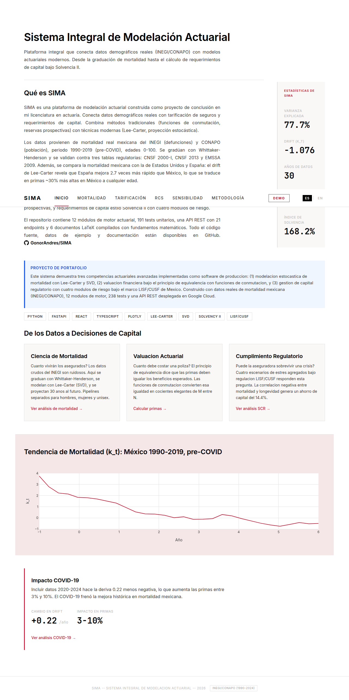
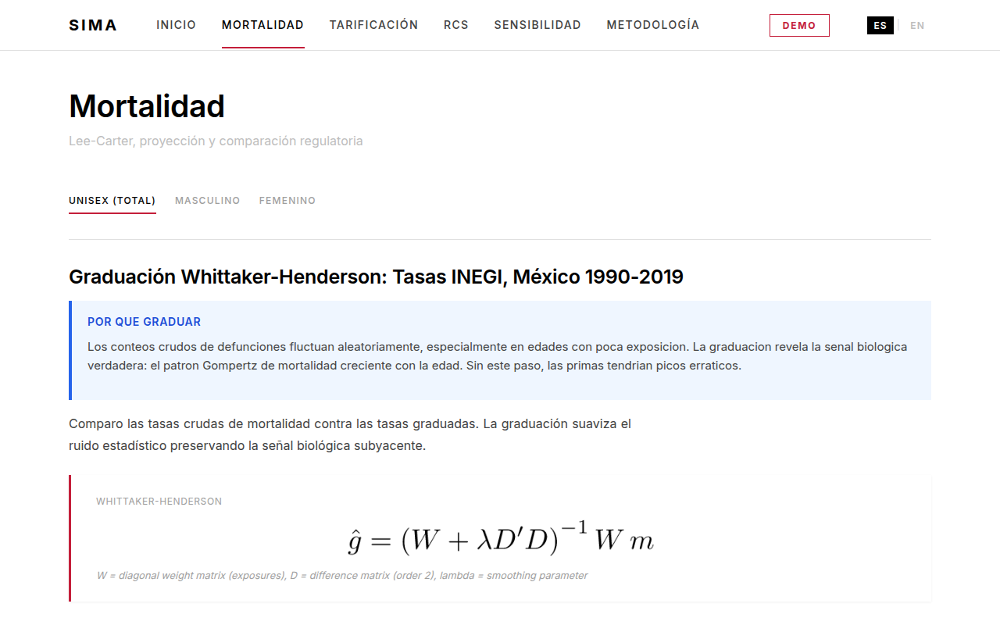
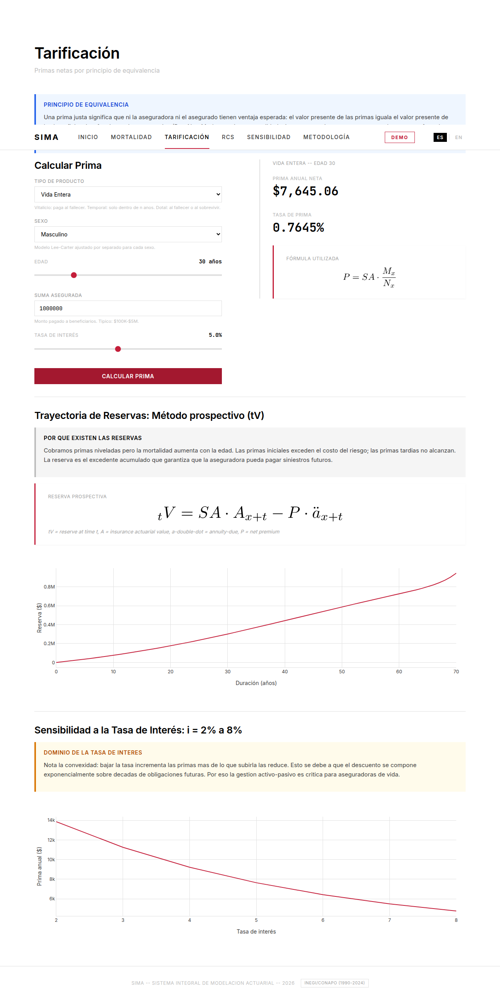
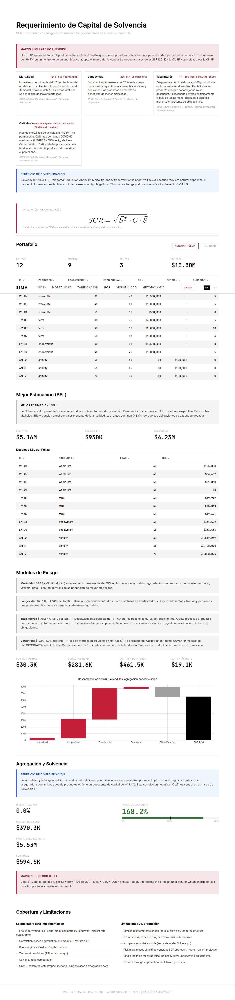
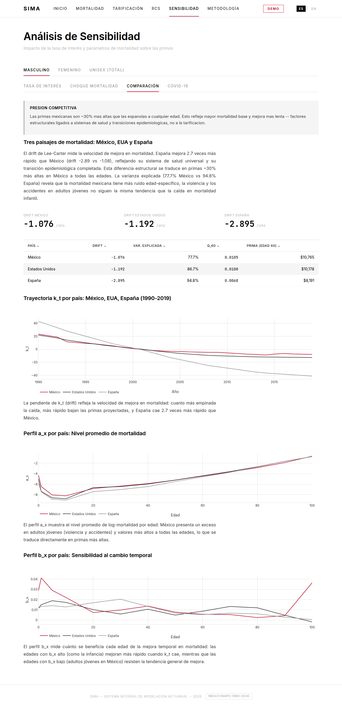

# SIMA -- Sistema Integral de Modelacion Actuarial

[](https://github.com/GonorAndres/SIMA/actions/workflows/ci.yml)

End-to-end actuarial modeling platform for life insurance: from raw demographic data to solvency capital requirements under Mexican regulation (LISF/CUSF).

**[Live Demo](https://sima-d3qj5vwxtq-uc.a.run.app)** | **[Methodology](https://sima-d3qj5vwxtq-uc.a.run.app/#/metodologia)**

---

## Screenshots

| Inicio | Mortalidad |
|--------|------------|
|  |  |

| Tarificacion | SCR |
|--------------|-----|
|  |  |

| Sensibilidad (Cross-country) |
|------------------------------|
|  |

---

## What This Project Demonstrates

Three core actuarial competencies implemented as production software:

1. **Stochastic Mortality Modeling** -- Whittaker-Henderson graduation of raw INEGI/CONAPO mortality data, Lee-Carter model via SVD, Random Walk with Drift projection, sex-differentiated pipelines (male/female/unisex)

2. **Financial Valuation** -- Commutation functions (D, N, C, M), net premiums via the equivalence principle, prospective reserves for three products (term, whole life, endowment)

3. **Regulatory Capital Management** -- Solvency Capital Requirement (SCR/RCS) with four risk modules (mortality, longevity, interest rate, catastrophe), correlation-based aggregation, risk margin, and solvency ratio under LISF/CUSF

---

## Architecture

```
INEGI/CONAPO Data
       |
  [ a06: MortalityData ]
       |
  [ a07: Whittaker-Henderson Graduation ]
       |
  [ a08: Lee-Carter SVD Fitting ]
       |
  [ a09: Random Walk with Drift Projection ]
       |                          |
  [ a10: Regulatory Validation ] [ to_life_table() bridge ]
       |                          |
       |     [ a01: LifeTable ] --+
       |            |
       |     [ a02: CommutationFunctions ]
       |            |
       |     [ a03: ActuarialValues ]
       |         /          \
       |  [ a04: Premiums ] [ a05: Reserves ]
       |            \          /
       |     [ a11: Portfolio + BEL ]
       |            |
       +---> [ a12: SCR Engine (4 risk modules) ]
                    |
              Solvency Ratio
```

---

## Tech Stack

| Layer | Technology |
|-------|-----------|
| Calculation Engine | Python 3.12, NumPy, SciPy (sparse matrices, SVD, Brent's method), Pandas |
| API | FastAPI, Pydantic v2, Uvicorn -- 22 REST endpoints across 5 routers |
| Frontend | React 19, TypeScript, Vite, Plotly.js (custom bundle), i18n (ES/EN) |
| Deployment | Docker (multi-stage), Google Cloud Run |
| Testing | pytest -- 205 unit tests + 33 API tests = 238 total |

---

## Key Features

- **12 engine modules** (a01-a12) with progressive dependency chain
- **Sex-differentiated analysis**: separate Lee-Carter fits for male, female, and unisex mortality
- **Real Mexican data pipeline**: INEGI deaths + CONAPO population (1990-2024)
- **Regulatory validation**: projected mortality compared against CNSF 2000-I and EMSSA 2009 tables
- **Sensitivity analysis**: interest rate sweeps, mortality shocks (+/-30%), cross-country comparison (Mexico/USA/Spain), COVID-19 impact
- **SCR with diversification**: mortality-longevity negative correlation (-0.25) yields 14.4% capital discount
- **6 authored LaTeX documents**: graduate-level mathematical derivations (SVD identifiability, W-H graduation, k_t re-estimation problem, EU Gender Directive analysis)

---

## Quick Start

### Prerequisites

- Python 3.12+
- Node.js 18+
- HMD or INEGI/CONAPO data (see `backend/data/*/DOWNLOAD_GUIDE.md`)

### Backend

```bash
python -m venv venv
source venv/bin/activate
pip install -r requirements.txt

# Run tests
pytest backend/tests/ -v

# Start API server
uvicorn backend.api.main:app --host 0.0.0.0 --port 8000
```

### Frontend

```bash
cd frontend
npm install
npm run dev
# Open http://localhost:5173
```

### Docker

```bash
docker build -t sima .
docker run -p 8080:8080 sima
# Open http://localhost:8080
```

---

## API Endpoints

23 endpoints across 5 routers:

| Router | Endpoints | Description |
|--------|-----------|-------------|
| `/api/mortality` | 8 | Data summary, Lee-Carter fit, projection, life table, validation, graduation, surface, diagnostics |
| `/api/pricing` | 4 | Premium calculation, reserve trajectory, commutation functions, pricing sensitivity |
| `/api/sensitivity` | 3 | Mortality shock, cross-country comparison, COVID impact |
| `/api/portfolio` | 4 | Portfolio summary, BEL computation, policy management, reset |
| `/api/scr` | 3 | SCR computation, default parameters, LISF compliance |

All mortality/pricing/sensitivity endpoints accept a `sex` parameter (`male`, `female`, `unisex`).

---

## Documentation

This project includes 64+ documentation files:

- **24 technical references** -- formal definitions, formulas, proofs (`docs/technical/`)
- **24 intuitive explanations** -- conceptual understanding, analogies (`docs/intuitive_reference/`)
- **12 project logs** -- session decisions, tradeoffs, findings (`docs/project/`)
- **6 LaTeX PDFs** -- graduate-level derivations (`docs/latex/`)

See the [Methodology page](https://sima-d3qj5vwxtq-uc.a.run.app/#/metodologia) for an interactive overview.

---

## Data Sources and Attribution

### Human Mortality Database (HMD)

> HMD. Human Mortality Database. Max Planck Institute for Demographic Research (Germany), University of California, Berkeley (USA), and French Institute for Demographic Studies (France). Available at www.mortality.org.

HMD data are licensed under **CC BY 4.0**. Raw data files are not included in this repository -- see `backend/data/hmd/DOWNLOAD_GUIDE.md`.

### Mexican Demographic Data

- **INEGI**: Deaths by age and sex (1990-2024)
- **CONAPO**: Mid-year population estimates
- **CNSF**: Regulatory mortality tables (CNSF 2000-I, CNSF 2013, EMSSA 2009)

Real data files are gitignored. Mock synthetic data in `backend/data/mock/` enables testing without real sources.

---

## Project Structure

```
backend/
  engine/          # 12 actuarial modules (a01-a12)
  api/             # FastAPI application (routers, schemas, services)
  analysis/        # Standalone analysis scripts (Mexico, sensitivity, capital)
  tests/           # 238 tests (unit + API)
  data/            # Mortality data (HMD, INEGI/CONAPO, mock)
frontend/
  src/pages/       # 6 pages (Inicio, Mortalidad, Tarificacion, SCR, Sensibilidad, Metodologia)
  src/components/  # Reusable components (charts, forms, layout, data display)
docs/
  technical/       # Formal reference docs
  intuitive_reference/  # Conceptual explanations
  project/         # Session logs
  latex/           # LaTeX source + compiled PDFs
```

---

## Author

**Andres Gonzalez Ortega**
Bachelor's in Actuarial Science, UNAM (Universidad Nacional Autonoma de Mexico)

---

## License

This project is for educational and portfolio purposes.
